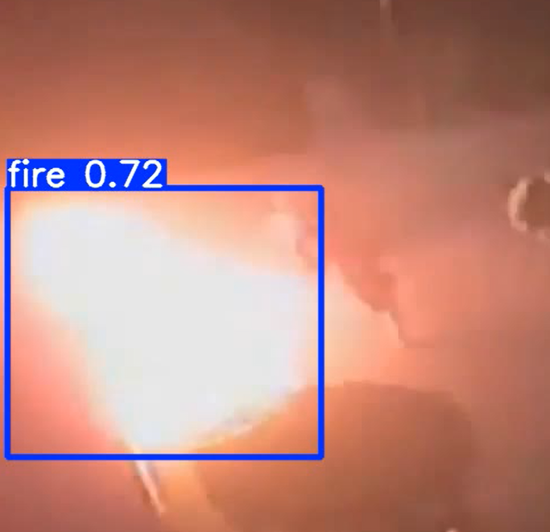
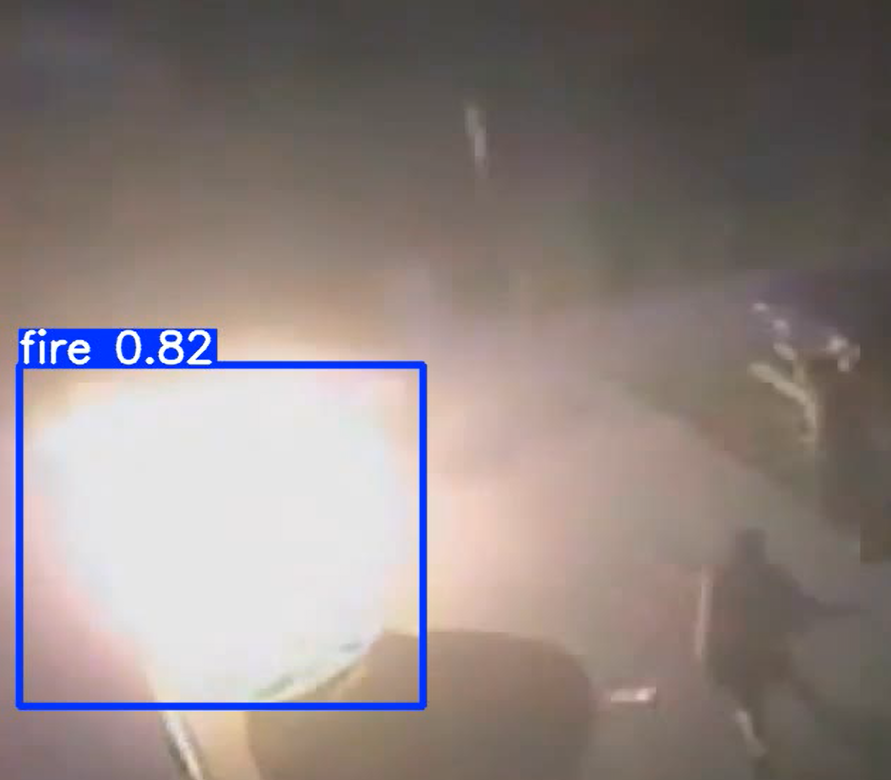
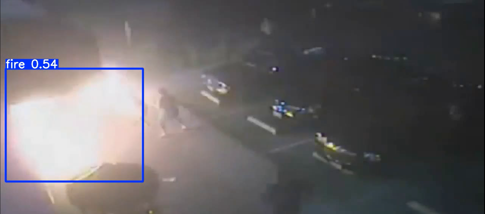

# 🔥 Fire Detection using YOLOv11

A real-time fire detection system built on **YOLOv11 (Ultralytics)**, trained to identify fire in images and video frames using bounding box object detection. The model is optimized for fast and accurate detection, making it suitable for both edge devices and cloud-based deployment.

## 🖼️ Sample Detection Result

<p align="center">
  
</p>

<p align="center">
  <em>Fire detected with 0.72 confidence</em>
</p>

## 📌 Overview

Traditional fire detection systems rely on heat or smoke sensors, which may delay detection or fail in certain conditions.

This project introduces a **computer vision-based fire detection system** using a fine-tuned YOLOv11 model that detects fire directly from visual data.

### ✅ This allows:
- Faster detection  
- Visual confirmation  
- Location awareness of fire incidents  

---

## 🚨 Potential Use Cases

- Industrial fire monitoring systems  
- Smart home fire safety  
- Forest fire surveillance  
- Parking garages and warehouses  
- Integration with automated emergency response systems  

---

## ✅ Best Results

| Metric | Value |
|--------|--------|
| Model | YOLOv11n (nano) |
| Dataset | Fire dataset (custom / extracted archive) |
| Image Size | 640×640 |
| Epochs | 50 (patience = 20) |
| Batch Size | 16 |
| mAP@0.5 | Tracked per epoch |
| mAP@0.5:0.95 | Best epoch selected via fitness score |

### 🧮 Fitness Score Formula
Fitness = 0.1 × mAP@0.5 + 0.9 × mAP@0.5:0.95

The best-performing epoch (`best.pt`) is used for inference.

---

## 🖼️ Sample Detections

- Fire detected with confidence scores (e.g., `fire 0.72`, `fire 0.43`, `fire 0.25`)
- Bounding boxes highlight fire regions in frames  

<p align="center">
  
  
</p>

Works across:
- Low-light scenes  
- High-intensity flames  
- Partial occlusions  

## 🗂️ Project Structure

```text
fire-detection/
│
├── FireDetection.ipynb          # Main training & inference notebook
├── data.yaml                    # Dataset config (classes, paths)
├── fire_dataset.zip             # Dataset archive
│
├── runs/
│   └── detect/
│       └── train/
│           ├── weights/
│           │   ├── best.pt      # Best model weights
│           │   └── last.pt      # Last epoch weights
│           └── results.csv      # Training metrics
│
└── README.md

## ⚙️ Setup & Installation

### 📋 Prerequisites

- Python 3.8+
- Google Colab (recommended) or Local GPU setup

---

### 📦 Install Dependencies

```bash
pip install ultralytics
```

---

## 📂 Mount Drive & Prepare Data (Google Colab)

```python
from google.colab import drive
drive.mount('/content/drive')

# Unzip dataset
!unzip /content/fire_dataset.zip -d /content
```

---

## 🚀 Training

```python
from ultralytics import YOLO

# Load base YOLOv11 nano model
model = YOLO("yolo11n.pt")

# Train model
model.train(
    data="data.yaml",
    epochs=50,
    imgsz=640,
    batch=16,
    patience=20
)
```

- Early stopping enabled (`patience = 20`)
- Training stops if no improvement is observed

---

## 🔍 Inference

```python
from ultralytics import YOLO

# Load best trained model
best_model = YOLO("runs/detect/train/weights/best.pt")

# Run prediction
best_model.predict(
    source="test/images",
    save=True
)
```

### 📁 Output Directory

```
runs/detect/predict/
```

---

## 📊 Evaluating Training Results

```python
import pandas as pd

results = pd.read_csv("runs/detect/train/results.csv", skipinitialspace=True)

map50 = results.iloc[:, 6]
map50_95 = results.iloc[:, 7]

fitness = (0.1 * map50) + (0.9 * map50_95)

best_epoch = fitness.idxmax() + 1

print(f"Best Epoch       : {best_epoch}")
print(f"Fitness Score    : {fitness.max():.4f}")
print(f"mAP@0.5:0.95     : {map50_95.iloc[fitness.idxmax()]:.4f}")
```

---

## 📦 Model Export

```python
model.export(format="onnx")
model.export(format="tflite")
```

| Format  | Platform                  |
|---------|---------------------------|
| `.pt`   | PyTorch / Server          |
| `.onnx` | Cross-platform Deployment |
| `.tflite` | Mobile / Edge Devices   |

---

## 📐 ML Metrics Reference

| Metric        | Description |
|--------------|------------|
| Precision     | TP / (TP + FP) |
| Recall        | TP / (TP + FN) |
| mAP@0.5       | Detection accuracy at IoU 0.5 |
| mAP@0.5:0.95  | Primary evaluation metric |
| Fitness       | Weighted YOLO score |

---

## 🧠 Motivation & Challenges

Fire detection using computer vision provides instant visual awareness compared to traditional heat or smoke sensors.

### 🔥 Key Advantages

- Detects fire even before smoke spreads  
- Provides exact fire location  
- Enables automated visual monitoring  

### ⚠️ Challenges Addressed

- Detecting fire under different lighting conditions  
- Differentiating fire from bright lights or reflections  
- Handling small or distant flames  
- Reducing false positives  

---

## 🔭 Future Work

- Combine fire + smoke detection into one model  
- Real-time video stream detection (CCTV / webcam)  
- Edge deployment (Jetson Nano, Raspberry Pi)  
- Improve dataset diversity (wildfire, indoor fire, vehicles)  
- Use segmentation for precise fire region detection  
- Integrate alert systems (SMS, alarms, IoT triggers)  

---

## 📚 References & Related Work

- Ultralytics YOLOv11 Documentation  
- Fire Detection Datasets (Roboflow / Kaggle)  
- YOLO-based Fire Detection Research  
- PyImageSearch Fire Detection Tutorials  

---

## 🛠️ Tech Stack

- Python  
- YOLOv11 (Ultralytics)  
- Google Colab  
- ONNX  
- TFLite  

---
